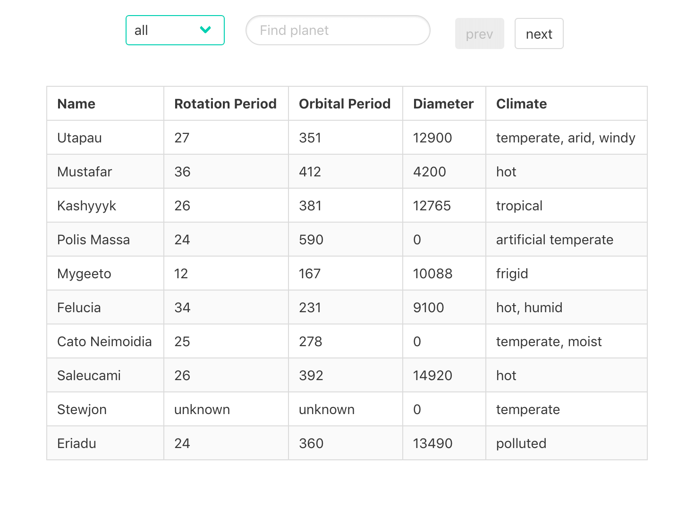
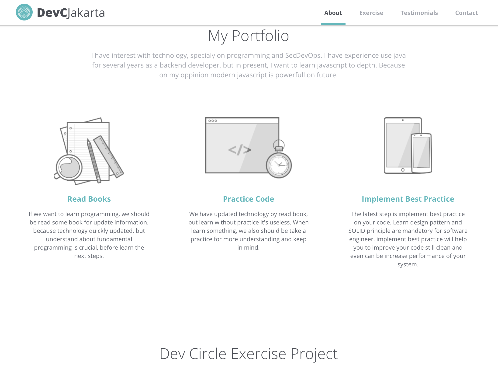

# devc-basic-js
Learn more about basic html, css and js with expert on devc community Jakarta.

## Exercise 1: Introduce html and css
###### click image to live demo
[](https://vendywira.github.io/devc-basic-js/src/exercise-1-introduce-html-css/)
##### repo: [source code](https://github.com/vendywira/devc-basic-js/tree/exercise-1-introduce-html-css)

## Exercise 2: Basic js and DOM manipulation
###### click image to live demo
[](https://vendywira.github.io/devc-basic-js/src/exercise-2-basic-js-and-dom-manipulation/)
##### repo: [source code](https://github.com/vendywira/devc-basic-js/tree/exercise-2-basic-js-and-dom-manipulation)

## Exercise 3: Basic Logic JS
###### click image to live demo
[](https://vendywira.github.io/devc-basic-js/src/exercise-3-javascript-and-basic-logic/)
##### repo: [source code](https://github.com/vendywira/devc-basic-js/tree/exercise-3-javascript-basic-logic)

## Exercise 4: final project
###### click image to live demo
[](https://vendywira.github.io/devc-basic-js/src/exercise-4-final-project/)
##### repo: [source code](https://github.com/vendywira/devc-basic-js/tree/exercise-4-final-project)


## Sass what is this??
when stylesheets are getting larger, more complex,
 and harder to maintain. we need sass for this condition. 
What is Sass? Sass is preprocessor which will help you to maintenance your css. we can use function, inheritance and
 operator like programming language.
 for implement sass on our project, we should be install node js and sass.
And then type command like bellow to auto compile scss to css when any changes.
```sass
sass --watch style.scss style.css
```

for more detail about sass you can read their documentation at [sass guideline](https://sass-lang.com/guide)

## BEM (Block Element Modifiers)
Convention for class naming on css to readable. For more detail you can read on [bem official website](http://getbem.com/introduction/)

## Basic DOM 
on exercise 2 we learn about basic js and how DOM work. we can use dom to manipulating view on html.

```javascript
const scientific = document.querySelector('.scientific')
const screen = document.querySelector('.calculator__display')
...

// we can also give action when user interact with dom like bellow

scientific.addEventListener('click', e => {
  if (e.target.classList.contains('button')) {
    const key = e.target
    const action = key.getAttribute('action');

    if (!action) {
      typeNumber()
    }

    if (action) {
      actions(action)
    }
  }
})
```
## Component Base
on exercise 3, I learn about function, class and object. also i read some literation about component base and how implement best practice on js. on all literation almost used on modern framework like react, vue or angular. but i want to implement on vanilla js. there are some problem when i try to implement it. such as the component should be independent not depend to other, first problem i found about how to communicate between components.
and i found a solution to provide each components their own data and will passing when communicate. but we must be remember, component is independent to other.
To resolve this problem i create global data center for sharing data that call state. but appear other problem, the component not only communicate with data, but also necessery action like loading and etc. therefor we need provide central action abstraction for component which one need call action other action. when i try to implement center action, i found matter about cyclic dependency. if we on java usually we use interface for loose coupling. but on js not have interface like java. after read some literation about it, finally i found a solution. the solution is use observable pattern to increase loose coupling on js. step 1 we must register the function which one subscribe the event, and when event trigered by other subcriber will receive updated data. And finally i have implemented component base on js. I also create some library utility to help call http, dom manipulation and main app (inspired by vue js work)

## Learn Bootstrap JQuery
on exercise 4 i have learn about media query, bootstrap and jquery used. very helpful for fast development web used bootstrap and jquery, but i have concern about performance. because jquery to heavy when firstly load when render webapp.

## License
The MIT License (MIT)

Copyright (c) 2019 I Wayan Vendy Wiranatha

Permission is hereby granted, free of charge, to any person obtaining a copy of this software and associated documentation files (the "Software"), to deal in the Software without restriction, including without limitation the rights to use, copy, modify, merge, publish, distribute, sublicense, and/or sell copies of the Software, and to permit persons to whom the Software is furnished to do so, subject to the following conditions:

The above copyright notice and this permission notice shall be included in all copies or substantial portions of the Software.

THE SOFTWARE IS PROVIDED "AS IS", WITHOUT WARRANTY OF ANY KIND, EXPRESS OR IMPLIED, INCLUDING BUT NOT LIMITED TO THE WARRANTIES OF MERCHANTABILITY, FITNESS FOR A PARTICULAR PURPOSE AND NONINFRINGEMENT. IN NO EVENT SHALL THE AUTHORS OR COPYRIGHT HOLDERS BE LIABLE FOR ANY CLAIM, DAMAGES OR OTHER LIABILITY, WHETHER IN AN ACTION OF CONTRACT, TORT OR OTHERWISE, ARISING FROM, OUT OF OR IN CONNECTION WITH THE SOFTWARE OR THE USE OR OTHER DEALINGS IN THE SOFTWARE.